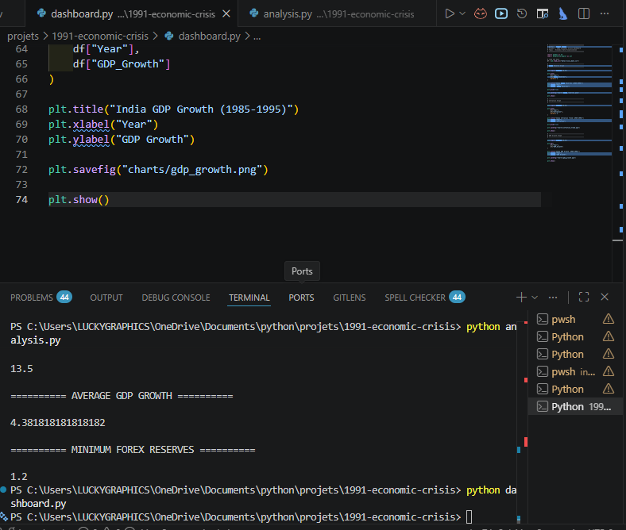

# 🇮🇳 01-1991-Economic-Crisis

# 📉 1991 Economic Crisis Analysis Dashboard

A Python-based economic analytics and visualization project focused on analyzing the historic **1991 Indian Economic Crisis** using data visualization, statistical analysis, and trend analysis.

This project studies India's financial instability during the late 1980s and early 1990s and visualizes how major economic indicators changed during the crisis period.

The project combines:

- Economics
- Statistics
- Data Analytics
- Data Visualization
- Python Programming

to explain one of the most important turning points in Indian economic history.

---

# 📚 Historical Background

In 1991, India faced one of the biggest economic crises in its modern history.

The country suffered from:

- Extremely low foreign exchange reserves
- High inflation
- Fiscal deficit pressure
- External debt crisis
- Weak industrial growth
- Balance of Payments (BoP) crisis

India's foreign exchange reserves fell so low that the country had reserves sufficient for only a few weeks of imports.

Several factors worsened the crisis:

- Gulf War Oil Price Shock
- Rising import bills
- Weak export growth
- Heavy government borrowing
- Political instability

This crisis later forced India to introduce the historic:

## LPG Reforms

- Liberalization
- Privatization
- Globalization

under Prime Minister **P. V. Narasimha Rao** and Finance Minister **Dr. Manmohan Singh**.

---

# 🎯 Project Objectives

The main objectives of this project are:

- Analyze India's economic indicators during the crisis period
- Visualize GDP growth fluctuations
- Study forex reserve decline
- Analyze inflation trends
- Practice Data Analytics using Python
- Build real-world economics dashboards
- Understand the background of 1991 reforms

---

# 🛠 Technologies Used

| Technology | Purpose |
|---|---|
| Python | Core Programming |
| Pandas | Data Analysis |
| Matplotlib | Data Visualization |
| NumPy | Numerical Calculations |
| Statistics | Statistical Analysis |
| CSV Files | Dataset Handling |

---

# 📂 Project Structure

```text
india-growth-dashboard/
│
├── 01-1991-economic-crisis/
│   │
│   ├── README.md
│   ├── analysis.py
│   ├── dashboard.py
│   ├── crisis_data.csv
│   ├── requirements.txt
│   │
│   ├── gdp_growth.png
│   ├── forex_reserves.png
│   ├── inflation_trend.png
│   └── economic_crisis_terminal_output.png
│
└── README.md
```

---

# 📊 Economic Indicators Included

This project analyzes and visualizes:

✅ GDP Growth Rate  
✅ Forex Reserve Decline  
✅ Inflation Trend  
✅ Economic Slowdown  
✅ Balance of Payments Crisis  
✅ Statistical Summary  
✅ Economic Visualization  

---

# 📈 GDP Growth Analysis

The GDP visualization shows how India's economic growth fluctuated during the crisis period.

<p align="center">
  
</p>

### 📌 Insights

- GDP growth declined sharply before reforms
- Industrial productivity weakened
- Economic instability affected national growth
- Recovery began after policy reforms

---

# 💰 Forex Reserve Analysis

This chart represents India's foreign exchange reserves during the crisis years.

<p align="center">
  
</p>

### 📌 Insights

- Forex reserves dropped critically
- India faced severe import payment pressure
- External financial stability weakened
- The country faced a Balance of Payments crisis

---

# 📉 Inflation Trend Analysis

This visualization shows inflation fluctuations during the economic crisis period.

<p align="center">
  
</p>

### 📌 Insights

- Inflation increased rapidly
- Rising prices affected common people
- Fuel and commodity prices surged
- Economic uncertainty increased nationwide

---

# 🖥 Terminal Output Snapshot

The project performs statistical analysis using Python.

<p align="center">
  
</p>

### 📌 Statistical Outputs

The analysis calculates:

- Maximum GDP Growth
- Average GDP Growth
- Minimum Forex Reserves
- Inflation Statistics
- Economic Trend Analysis
- Statistical Summary using Pandas

---

# 📊 Features

## Economic Data Analysis

- GDP Growth Analysis
- Forex Reserve Analysis
- Inflation Analysis
- Economic Trend Analysis
- Statistical Calculations
- CSV Dataset Processing

---

## Data Visualization

The project automatically generates:

- GDP Growth Charts
- Forex Reserve Charts
- Inflation Trend Charts
- Statistical Output Images

All PNG files are generated automatically using Matplotlib.

---

# 📚 Learning Outcomes

This project helps in understanding:

- Indian Economic Crisis
- Economic Liberalization Background
- Data Analytics using Python
- Statistical Thinking
- Economic Data Visualization
- Pandas DataFrames
- GitHub Project Structuring
- Economic Research Concepts

---

# 🇮🇳 Importance of the 1991 Crisis

The 1991 crisis became one of the most important turning points in Indian economic history.

The crisis forced India to:

- Open markets globally
- Reduce government control
- Encourage foreign investment
- Modernize industries
- Reform taxation and trade systems

These reforms later transformed India into one of the world's fastest-growing economies.

---

# 📚 Data Sources & References

The project uses educational and publicly available economic references.

## 📊 Sources

- Reserve Bank of India (RBI)
- World Bank Open Data
- International Monetary Fund (IMF)
- Ministry of Finance, Government of India
- MOSPI
- Economic Survey of India

---

# 🏛 Government & Institutional References

The project concept references publicly available information from:

- RBI Reports
- Government Economic Reports
- IMF Reports
- World Bank Economic Data
- Ministry of Finance Publications

---

# 🎓 Learning Purpose

This project is created for:

- Educational Purposes
- Economic Analytics Learning
- Python Practice
- Statistics Learning
- Visualization Practice
- Data Science Projects

This project does not provide financial or investment advice.

---

# ▶️ How to Run the Project

## Step 1 — Install Required Libraries

```bash
pip install -r requirements.txt
```

---

## Step 2 — Run Analysis File

```bash
python analysis.py
```

This script:

- Performs statistical analysis
- Generates economic insights
- Displays summary statistics

---

## Step 3 — Run Dashboard File

```bash
python dashboard.py
```

This script:

- Generates charts automatically
- Saves PNG files automatically
- Creates dashboard visualizations

---

# 🚀 Future Improvements

Possible future upgrades:

- Streamlit Interactive Dashboard
- Real Government Dataset Integration
- Oil Price Impact Analysis
- Rupee Devaluation Study
- Advanced Economic Dashboards
- AI-Based Economic Predictions
- Interactive Visualizations

---

# 👩‍💻 Author

**Saloni Tiwari**

Python | Data Analytics | Statistics | Economic Visualization

---

# 📜 License

This project is created for educational and learning purposes.
