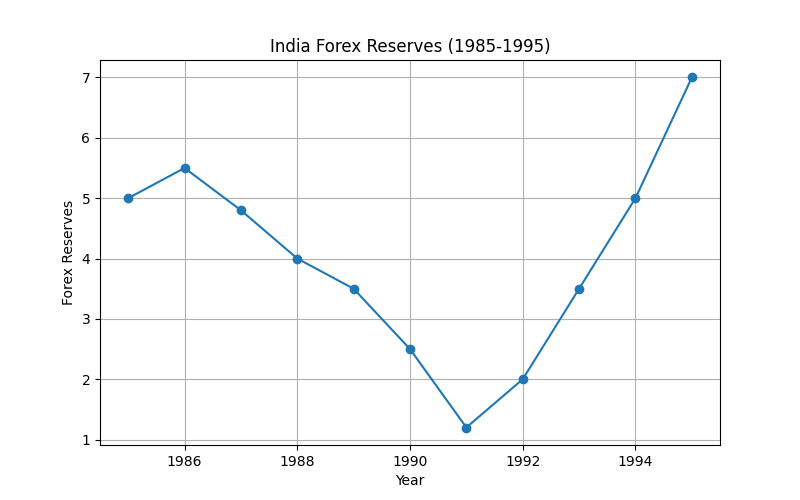
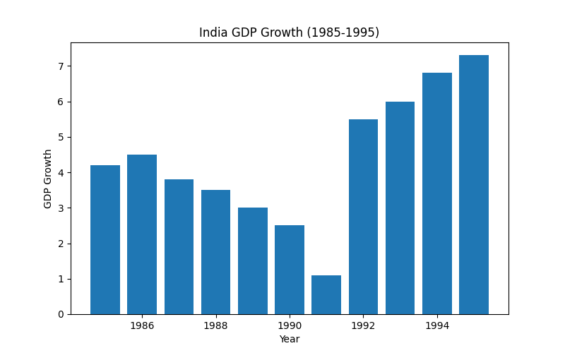
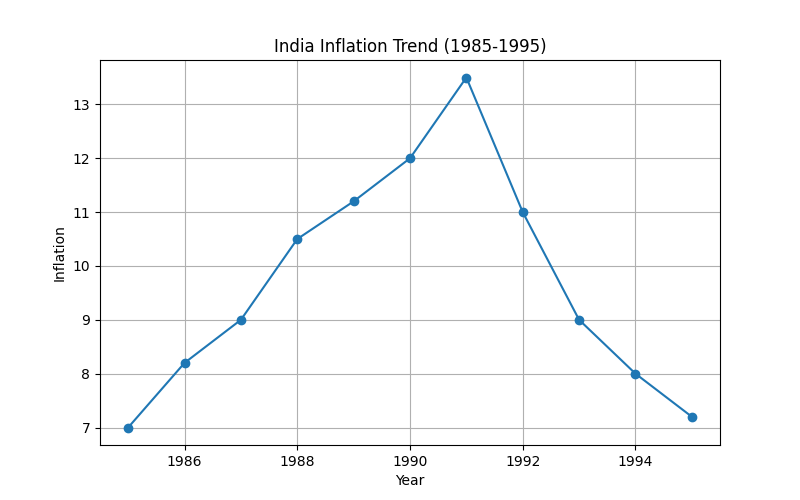

# 🇮🇳 INDIA ECONOMIC REFORMS SERIES


A comprehensive collection of Python-based Economic Analytics projects focused on analyzing India's economic history, major reforms, financial crises, macroeconomic indicators, and development journey.

This repository transforms important economic events and reforms into data-driven analytical projects to bridge the gap between economics and modern data science techniques.

---

# 🎯 Repository Goals

This repository is designed to help learners:

- Understand India's economic evolution
- Analyze major economic reforms
- Study financial crises using data
- Practice Data Analytics using economic datasets
- Build research-oriented analytics projects
- Develop dashboard and visualization skills
- Learn Economics through practical Python projects

---

# 🛠 Technologies Used

## Programming

- Python

## Data Analysis

- Pandas
- NumPy

## Visualization

- Matplotlib
- Plotly

## Dashboard Development

- Streamlit

## Statistics

- Descriptive Statistics
- Trend Analysis
- Correlation Analysis

## Database Analytics

- SQL

## Development Tools

- VS Code
- Git
- GitHub

---

# 📂 Repository Structure

```text
INDIA-ECONOMIC-REFORMS-SERIES/
│
├── 01-1991-economic-crisis/
│   ├── charts/
│   │   ├── economic_crisis_terminal_output.png
│   │   ├── forex_reserves.png
│   │   ├── gdp_growth.png
│   │   └── inflation_trend.png
│   ├── data/
│   │   └── crisis_data.csv
│   ├── sql/
│   │   └── crisis_analysis.sql
│   ├── analysis.py
│   ├── dashboard.py
│   ├── requirements.txt
│   └── README.md
│
├── 02-1991-economic-reforms/
│   └── ...
├── 03-rupee-devaluation-analysis/
│   └── ...
├── 04-harshad-mehta-scam-analysis/
│   └── ...
├── 05-oil-price-impact-analysis/
│   └── ...
├── 06-inflation-vs-common-goods/
│   └── ...
├── 07-agriculture-vs-inflation/
│   └── ...
├── 08-share-market-analytics/
│   └── ...
├── 09-employment-trend-analysis/
│   └── ...
└── README.md
```

---

# 🚀 Current Projects

| No. | Project                                                        | Core Focus                                              |
|-----|----------------------------------------------------------------|---------------------------------------------------------|
| 01  | 1991 Economic Crisis                                           | Forex Crisis, Inflation & GDP Instability               |
| 02  | India Growth Dashboard                                         | Macroeconomic Trends & India Growth Story               |
| 03  | Harshad Mehta Scam                                             | Share Market Manipulation & Banking Crisis              |
| 04  | 1993 Tax Reforms Analysis                                      | Tax Structure Reform & Fiscal Policy                    |
| 05  | 1992-93 CCI and SEBI Rise                                      | Regulatory Evolution in Indian Markets                  |
| 06  | 1992-94 NSE Electronic Revolution                              | Automation of Stock Exchange                            |
| 07  | 1993 Private Banking Revolution                                | Banking Sector Transformation                           |
| 08  | 1994 Service Tax Introduction                                  | Indirect Taxation & Services Sector                     |
| 09  | 1995 WTO Membership - India                                    | Foreign Trade, Tariff Policy & Globalization            |
| 10  | 1998 Pokhran Sanctions & Resurgent Bond                        | Forex Solution & External Challenges                    |
| 11  | 2000 Foreign Exchange Management Act (FEMA)                    | Reforms in Forex Regulation                             |
| 12  | 2003 FRBM Act & Fiscal Discipline                              | Fiscal Deficit Control and Fiscal Policy                |
| 13  | 2006 MGNREGA Rural Employment Guarantee                        | Welfare Economics & Employment Generation               |
| 14  | 2008 Global Financial Crisis & India Resilience                | Economic Downturn & Indian Response                     |
| 15  | 2001 Abdul Karim Telgi Stamp Scam                              | Counterfeit, Scams & Regulation Strengthening           |
| 16  | 2009 Satyam Computers Collapse                                 | Corporate Fraud, Governance & Audit                     |

---

# 📊 Features Included

Every project contains:

✅ Dataset Analysis  
✅ Statistical Insights  
✅ Trend Analysis  
✅ Economic Visualization  
✅ Correlation Analysis  
✅ Streamlit Dashboard  
✅ Python-Based Analytics  
✅ Research-Oriented Structure  
✅ Documentation & Insights  

---

# 📊 Data Visualizations (1991 Economic Crisis Example)

## Terminal Output


---

## 1. Forex Reserves



---

## 2. GDP Growth



---

## 3. Inflation Trend



---

# 📷 Repository Dashboards

## 📉 1991 Economic Crisis Dashboard


---

## 📈 1991 Economic Reforms Dashboard

*(Next Project Example)*

---

# 📚 Economic Concepts Covered

This repository explores:

- Economic Crisis
- Liberalization
- Privatization
- Globalization
- Forex Reserves
- Inflation
- GDP Growth
- Currency Devaluation
- Banking Crisis
- Share Market Events
- Oil Price Shocks
- Employment Trends
- Agricultural Economics
- Economic Indicators

---

# 📊 Skills Demonstrated

## Economics

- Macroeconomics
- Monetary Economics
- Development Economics
- Indian Economic History
- Financial Crisis Analysis
- Economic Reforms

## Statistics

- Trend Analysis
- Growth Analysis
- Correlation
- Descriptive Statistics

## Data Analytics

- Data Cleaning
- Data Visualization
- Dashboard Development
- CSV Data Handling

## Programming

- Python
- Pandas
- NumPy
- Matplotlib
- SQL

---

# 📂 Standard Project Architecture

Each project follows a standardized structure:

```text
project-folder/
│
├── charts/
├── data/
├── sql/
├── analysis.py
├── dashboard.py
├── requirements.txt
└── README.md
```

---

# 📈 Typical Outputs

Projects generate:

- Statistical Reports
- Trend Analysis
- Economic Visualizations
- Dashboard Insights
- Correlation Reports
- Crisis Analysis Reports
- Historical Economic Interpretation

---

# 📚 Data Sources & References

The datasets and concepts used in this repository are inspired by publicly available economic reports, educational resources, and government publications.

## Main Reference Sources

- Reserve Bank of India (RBI)
- Ministry of Finance, Government of India
- MOSPI
- Economic Survey of India
- World Bank Open Data
- International Monetary Fund (IMF)
- SEBI Reports
- Government Budget Documents
- Public Economic Research Sources

---

# 📖 Historical Topics Studied

The repository studies important Indian economic events including:

- 1991 Economic Crisis
- Economic Liberalization
- Rupee Devaluation
- Banking & Share Market Events
- Inflation Trends
- Oil Price Impact
- Forex Reserve Changes
- Economic Growth Patterns

---

# 🎯 Learning Purpose

This repository is created for:

- Educational Purposes
- Data Analytics Practice
- Economic Research Learning
- Portfolio Development
- Python Practice
- Dashboard Development
- Statistics Learning

This repository does not provide investment, financial, political, or policy advice.

---

# 🚀 Future Improvements

Planned future upgrades include:

- Machine Learning Forecasting
- Advanced SQL Analytics
- Real-Time Economic Data
- Interactive Plotly Dashboards
- AI-Based Economic Predictions
- Advanced Economic Correlation Models
- Automated Report Generation
- Multi-Country Economic Comparison

---

# 📦 Installation

## Clone Repository

```bash
git clone https://github.com/25f2005869-glitch/INDIA-ECONOMIC-REFORMS-SERIES.git
```

## Enter Repository

```bash
cd INDIA-ECONOMIC-REFORMS-SERIES
```

## Install Dependencies

```bash
pip install -r requirements.txt
```

---

# ▶ Run Any Project

Example:

```bash
cd 01-1991-economic-crisis
```

Run Analysis:

```bash
python analysis.py
```

Run Dashboard:

```bash
streamlit run dashboard.py
```

---

# 🎓 Learning Outcomes

After completing this repository, learners will understand:

- Indian Economic History
- Economic Crisis Analysis
- Economic Reform Analytics
- Data Visualization
- Dashboard Development
- Statistical Thinking
- Economic Data Interpretation
- Python for Analytics

---

# 🌍 Real-World Applications

This repository supports:

- Economics Learning
- Data Analytics Education
- Research Projects
- Portfolio Building
- Academic Demonstrations
- Dashboard Development
- Historical Economic Analysis

---

# 👩‍💻 Author

## Saloni Tiwari

🎓 IIT Madras BS Degree in Data Science  
🎓 B.Sc Mathematics

### Skills

- Python
- Statistics
- Data Analytics
- SQL
- Data Visualization
- Streamlit
- Economic Analytics

---

# ⭐ Repository Status

✅ Active Repository  
✅ Long-Term Economic Analytics Series  
✅ Research-Oriented Project Collection  
✅ Dashboard & Visualization Integration  
✅ Portfolio Ready

---

# 📢 Repository Vision

Studying India's Economic Journey Through Data Analytics  
Transforming economic history, reforms, crises, and macroeconomic indicators into actionable insights using Python, Statistics, SQL, Visualization, and Interactive Dashboards.

---

⭐ If you found this repository useful, consider giving it a star on GitHub.
