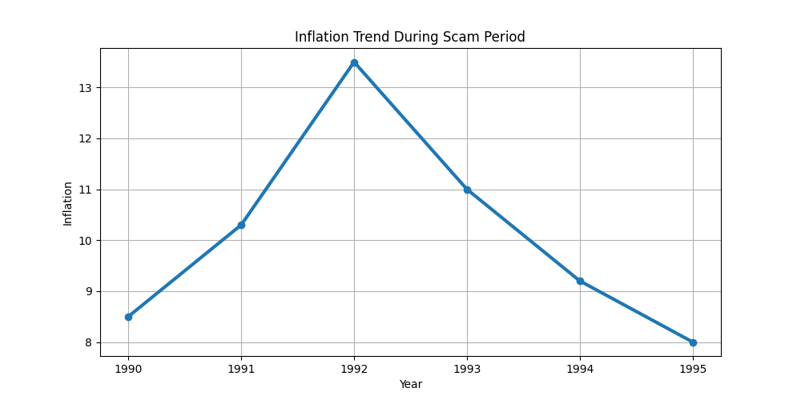

# 📈 1992 Harshad Mehta Scam Analysis Dashboard

A Python-based financial data analytics project focused on analyzing the **1992 Harshad Mehta Stock Market Scam** and its impact on the Indian stock market, banking system, inflation, and investor confidence.

This project uses **Python, Pandas, Matplotlib, NumPy, and Statistics** to visualize economic trends and understand one of the biggest financial scams in Indian history.

---

# 📌 Project Purpose

The main purpose of this project is to study:

- Stock Market Boom and Crash
- Sensex Growth During Scam Period
- Inflation Trend
- Banking System Weakness
- Economic & Regulatory Reforms
- Financial Data Analysis using Python

This project also helps in understanding how the scam changed India's financial system and market regulations forever.

---

# 🎯 Project Objectives

- Analyze historical financial data
- Visualize stock market fluctuations
- Study the impact of the scam on investors
- Understand economic reforms after the scam
- Learn data analytics using Python
- Build real-world financial analytics projects

---

# 🛠 Technologies Used

- Python
- Pandas
- Matplotlib
- NumPy
- Statistics
- CSV Data Handling

---

# 📂 Project Structure

1992-harshad-mehta-scam/

├── analysis.py  
├── dashboard.py  
├── data/  
│   └── scam_data.csv  
├── charts/  
│   ├── sensex_growth.png  
│   ├── market_crash.png  
│   ├── inflation_trend.png  
│   └── banking_impact.png  
├── harshad_mehta_analysis_output.png  
├── requirements.txt  
└── README.md

---

# 📊 Economic Indicators Included

This project analyzes:

✅ Sensex Growth  
✅ Market Crash Analysis  
✅ Inflation Trend  
✅ Banking Crisis Impact  
✅ Investor Panic  
✅ Statistical Summary  
✅ Economic Visualization

---

# 📈 Sensex Growth Analysis

The visualization shows the artificial stock market boom created during the scam period.

## Output Visualization


### Insights

- Stock prices increased abnormally
- Market experienced artificial bullish growth
- Investor speculation increased rapidly

---

# 📉 Market Crash Analysis

This chart represents the sudden market collapse after the scam exposure.

## Output Visualization


### Insights

- Sensex crashed sharply after exposure
- Investors suffered major losses
- Banking liquidity problems increased

---

# 💹 Inflation Trend Analysis

This visualization shows inflation fluctuations during the scam period.

## Output Visualization



### Insights

- Inflation pressure increased during instability
- Economic uncertainty affected markets
- Commodity prices became volatile

---

# 🏦 Banking System Impact

This visualization represents the effect of fake banking transactions and liquidity misuse.

## Output Visualization


### Insights

- Weak banking controls were exposed
- Fake Bank Receipts caused financial instability
- Regulatory weaknesses became visible

---

# 🖥 Analysis Terminal Output

The project also performs statistical analysis using Python.

## Output Screenshot


### Statistical Outputs

The analysis calculates:

- Maximum Sensex Growth
- Average Market Growth
- Inflation Statistics
- Banking Impact Summary
- Statistical Summary using Pandas

---

# 📚 Scam Mechanism Explained

The scam mainly worked through:

- Ready Forward Deals
- Fake Bank Receipts (BRs)
- Banking loopholes
- Artificial stock price manipulation

Harshad Mehta used banking system weaknesses to inject huge money into selected stocks.

---

# 📉 Impact on Indian Stock Market

## Artificial Bull Run (1991–1992)

- ACC shares rose from around ₹200 to nearly ₹9,000
- Sensex crossed 4,000 points
- Investors entered aggressively

## Scam Exposure (April 1992)

Journalist **Sucheta Dalal** exposed the scam.

After exposure:

- Market crashed heavily
- Sensex lost massive value
- Banks demanded repayment
- Investor confidence collapsed

---

# 🏛 Major Financial Reforms After Scam

This scam changed India's financial system permanently.

## Key Reforms

### ✅ SEBI Strengthened

SEBI received legal powers through the SEBI Act, 1992.

### ✅ NSE Establishment

National Stock Exchange (NSE) was established to improve transparency.

### ✅ Electronic Trading & Demat System

Paper share systems were replaced by digital trading and Demat accounts.

---

# 📊 Features

✅ Financial Data Analysis  
✅ Market Trend Visualization  
✅ Statistical Calculations  
✅ CSV Dataset Handling  
✅ Banking Impact Analysis  
✅ Real-world Financial Insights

---

# 📚 Learning Outcomes

This project helped in learning:

- Financial Data Analytics
- Python Programming
- Pandas DataFrames
- Data Visualization
- Historical Market Analysis
- Statistical Thinking
- GitHub Project Structuring

---

# 📚 Data Sources & References

The project uses educational and historical financial references for learning purposes.

## 📑 Data Sources

- Reserve Bank of India (RBI)
- Securities and Exchange Board of India (SEBI)
- NSE Historical References
- BSE Historical Data
- Economic Times Archives
- Financial Express Reports
- Business Standard Articles

---

# 📖 Historical References

This project is inspired by real historical events including:

- 1992 Harshad Mehta Scam
- Indian Stock Market Crash
- Banking System Weaknesses
- SEBI Reforms
- NSE Establishment
- Financial Liberalization Era

---

# 🏛 Government & Institutional References

The project references publicly available information from:

- RBI Reports
- SEBI Reports
- Ministry of Finance
- NSE India
- BSE India

---

# 🎓 Learning Purpose

This project is created for:

- Educational Purposes
- Financial Data Learning
- Economic Visualization
- Python Practice
- Historical Market Analysis

The visualizations and datasets are simplified for educational understanding.

---

# 🚀 Future Improvements

Future upgrades planned for this project:

- Interactive Streamlit Dashboard
- Real-Time Stock Market Data
- AI-Based Market Prediction
- Scam Network Visualization
- Advanced Statistical Models
- Investor Sentiment Analysis
- Banking Fraud Detection Concepts

---

# 📦 Installation

Clone the repository:

```bash
git clone https://github.com/25f2005869-glitch/india-growth-dashboard.git