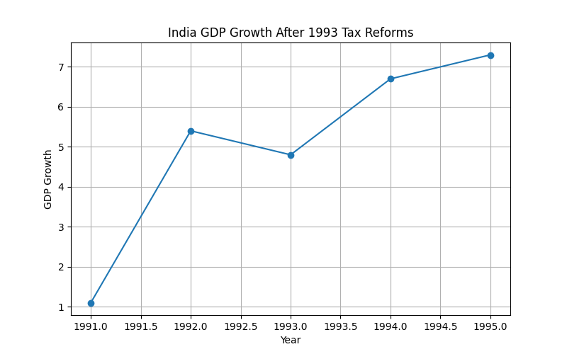
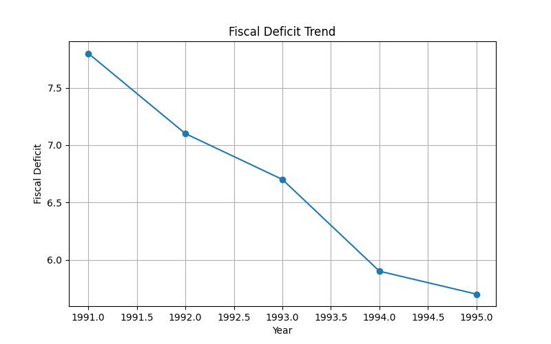
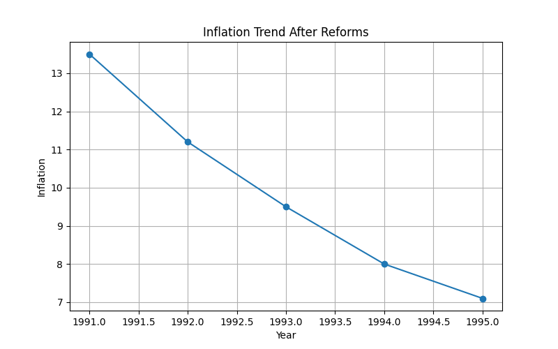
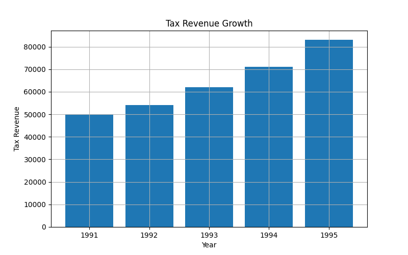
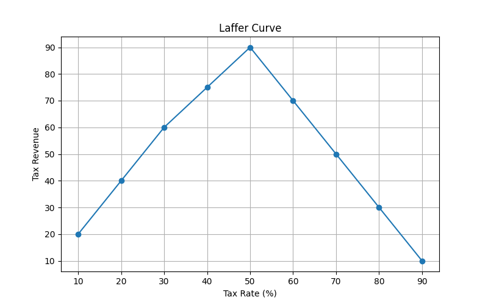
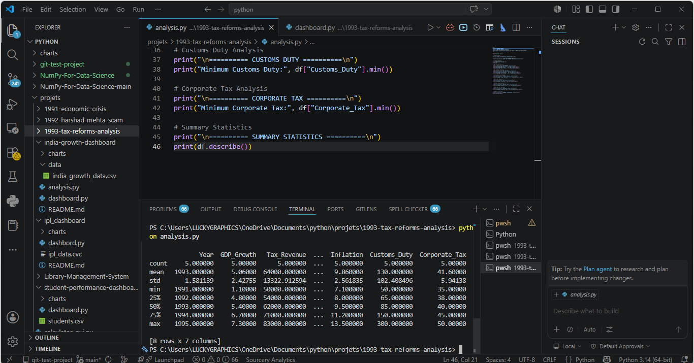

# 🇮🇳 India Growth Dashboard — 1993 Tax Reforms Analysis

## 📌 Project Overview

This project analyzes the historic **1993 Indian Tax Reforms** introduced during India’s economic liberalization period under the leadership of **Dr. Manmohan Singh** and based on the recommendations of the **Raja Chelliah Committee**.

Using **Python**, **Pandas**, and **Matplotlib**, the project performs economic data analysis and generates visual dashboards explaining how taxation reforms transformed India’s economy.

---

# 📚 Historical Background

During the early 1990s, India faced a severe economic crisis:

- High Fiscal Deficit
- Low Foreign Exchange Reserves
- Slow Industrial Growth
- Weak Tax Structure
- High Inflation

To stabilize and modernize the economy, India introduced major reforms in 1991–1993.

One of the biggest reforms was the restructuring of India's taxation system through the recommendations of the **Tax Reforms Committee** chaired by **Dr. Raja J. Chelliah**.

These reforms laid the foundation for modern Indian taxation and economic liberalization.

---

# 🎯 Project Objectives

This project aims to:

- Analyze economic indicators after tax reforms
- Visualize trends using charts
- Understand the impact of tax reforms on growth
- Study fiscal deficit and inflation trends
- Demonstrate the Laffer Curve concept
- Build economics + data science integration skills

---

# 🛠 Technologies Used

| Technology | Purpose |
|---|---|
| Python | Data Analysis |
| Pandas | Data Processing |
| Matplotlib | Data Visualization |

---

# 📂 Project Structure

```text
india-growth-dashboard/
│
├── 04-1993-tax-reforms-analysis/
│   │
│   ├── README.md
│   ├── analysis.py
│   ├── dashboard.py
│   ├── requirements.txt
│   │
│   ├── charts/
│   │   ├── customs_duty.png
│   │   ├── fiscal_deficit.png
│   │   ├── gdp_growth.png
│   │   ├── inflation_trend.png
│   │   ├── laffer_curve.png
│   │   ├── tax_reforms_terminal_output.png
│   │   └── tax_revenue_growth.png
│   │
│   └── data/
│       └── tax_reforms_data.csv
```

---

# 📊 Charts & Visualizations

## 1️⃣ GDP Growth Trend

Shows how India's GDP growth improved after economic liberalization.

<p align="center">
  
</p>

---

## 2️⃣ Fiscal Deficit Analysis

Displays reduction trends in fiscal deficit after reforms.

<p align="center">
  
</p>

---

## 3️⃣ Inflation Trend

Analyzes inflation movement during economic stabilization.

<p align="center">
  
</p>

---

## 4️⃣ Tax Revenue Growth

Illustrates how tax collection increased despite lower tax rates.

<p align="center">
  
</p>

---

## 5️⃣ Customs Duty Reduction

Shows the gradual reduction in customs duties after reforms.

<p align="center">
  
</p>

---

## 6️⃣ Laffer Curve Visualization

Demonstrates the economic theory that moderate tax rates may increase total tax revenue.

<p align="center">
  
</p>

---

## 7️⃣ Terminal Output Snapshot

Displays statistical analysis generated from Python scripts.

<p align="center">
  
</p>

---

# 📈 Key Economic Insights

## ✅ Simplification of Tax Structure

The reforms simplified India’s complex tax system and improved tax compliance.

---

## ✅ Reduction in Customs Duty

Peak customs duties were significantly reduced, making imports cheaper and industries more competitive.

---

## ✅ Growth in Tax Revenue

Even after lowering tax rates, government tax revenue increased due to improved compliance.

---

## ✅ Foundation for GST

The reforms eventually paved the way for:

- Service Tax
- VAT
- GST

---

# 🧠 Laffer Curve Concept

> Extremely high tax rates may reduce tax collection, while moderate tax rates can increase government revenue.

This project uses Indian tax reform data as a practical example of the theory.

---

# ▶️ How to Run the Project

## Step 1 — Install Dependencies

```bash
pip install -r requirements.txt
```

---

## Step 2 — Run Economic Analysis

```bash
python analysis.py
```

This script:
- Performs statistical analysis
- Prints economic insights
- Generates terminal summaries

---

## Step 3 — Run Dashboard Generator

```bash
python dashboard.py
```

This script:
- Creates all charts automatically
- Saves PNG files automatically

---

# 📌 Features

✅ Economic Data Analysis  
✅ Fiscal Deficit Visualization  
✅ GDP Growth Analysis  
✅ Inflation Analysis  
✅ Laffer Curve Demonstration  
✅ Tax Revenue Visualization  
✅ Matplotlib Dashboard Generation  

---

# 🚀 Future Improvements

Possible future upgrades:

- Streamlit Interactive Dashboard
- Real Government Dataset Integration
- Machine Learning Forecasting
- Inflation Prediction
- Tax Revenue Prediction
- Interactive Charts using Plotly

---

# 🎓 Learning Outcomes

This project helps in understanding:

- Indian Economic Liberalization
- Tax Reforms in India
- Fiscal Policy
- Economic Statistics
- Data Visualization
- Python for Economics
- Laffer Curve Theory

---

# 👩‍💻 Author

**Saloni Tiwari**

---

# 📜 License

This project is created for educational and learning purposes.
