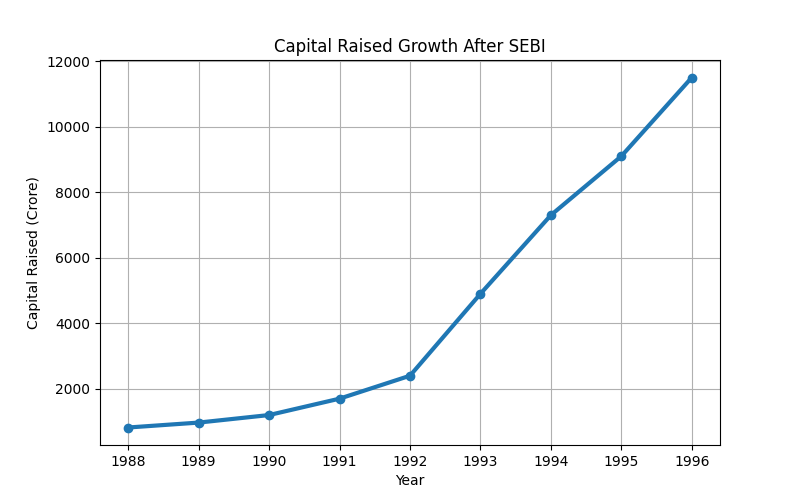
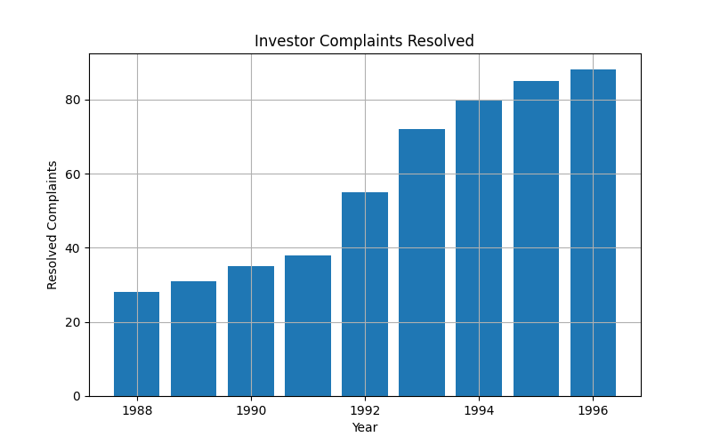
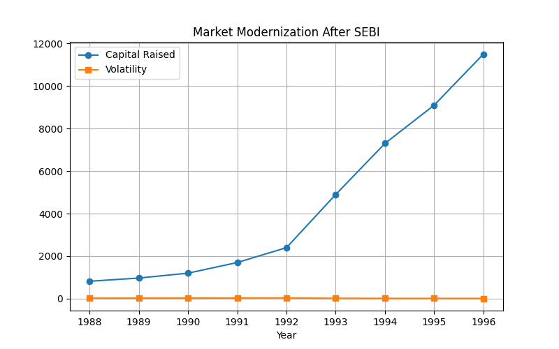
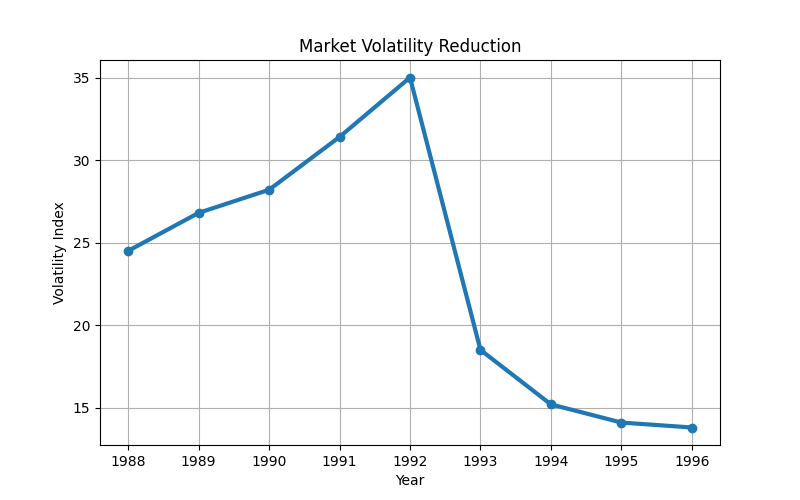
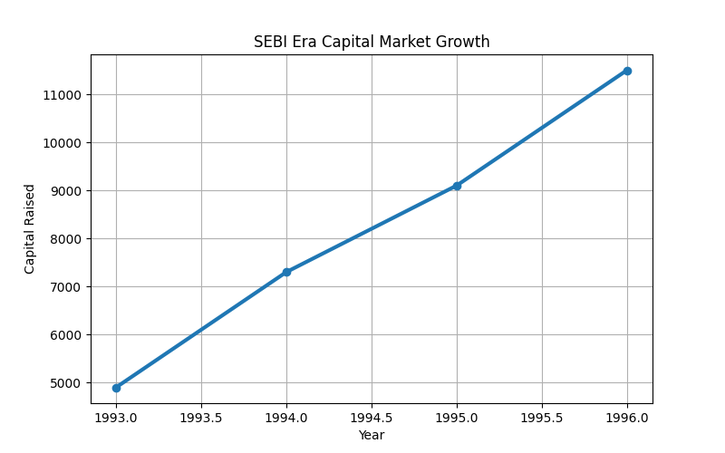

# 05-1992-93-cci-end-sebi-rise

## India’s Capital Market Reforms (1992–93)

This project explains the rise of SEBI and major capital market reforms after the 1992 Harshad Mehta Scam.  
It highlights how India modernized stock markets, improved investor protection, and introduced regulatory reforms.

---

# Project Overview

After the 1992 stock market scam, India introduced major reforms to improve transparency and governance in financial markets.

This project covers:

- End of CCI (Controller of Capital Issues)
- Rise of SEBI as regulator
- Free pricing era
- Investor protection reforms
- Insider trading regulations
- Entry of Foreign Institutional Investors (FIIs)
- Corporate governance reforms
- Market modernization
- Capital market growth analysis

---

# Historical Background

Before 1992:

- Capital markets were heavily controlled
- CCI regulated share pricing
- Lack of transparency existed
- Manual trading systems were common
- Investor protection was weak

After the Harshad Mehta Scam:

- SEBI received stronger powers
- Capital market reforms accelerated
- Electronic trading systems developed
- Investor confidence improved
- Corporate governance standards strengthened

---

# Main Objectives

- Study India’s capital market reforms
- Analyze SEBI’s growth and role
- Understand post-1992 regulatory changes
- Visualize market modernization
- Explain investor protection reforms
- Track capital market expansion

---

# Project Features

| Feature | Description |
|---|---|
| Reform Analysis | Study of post-1992 reforms |
| Data Visualization | Growth charts and graphs |
| CSV Dataset | Reform-related data |
| Python Analysis | Market trend analysis |
| Dashboard | Visual reform presentation |

---

# Terminal Output

```bash
SEBI Reform Analysis Started...

Loading reform dataset...
Dataset loaded successfully

Generating charts...
Charts created successfully

Analysis completed
```

---

# Major Reform Phases

## 1️⃣ End of CCI

### Impact

- Share pricing became market-driven
- Companies gained pricing freedom
- Capital raising became easier

### Benefits

- Improved efficiency
- Better market competition
- Faster capital formation

---

## 2️⃣ SEBI Legal Powers

### Reforms

- SEBI became statutory regulator
- Monitoring powers increased
- Fraud investigations strengthened

### Benefits

- Stronger market regulation
- Better investor protection
- Reduced manipulation

---

## 3️⃣ Free Pricing Era

### Features

- Companies could price IPOs freely
- Market demand determined valuation
- Capital markets expanded rapidly

### Benefits

- Faster economic reforms
- More investment opportunities
- Increased private sector growth

---

## 4️⃣ Investor Protection Framework

### Measures

- Disclosure requirements improved
- Transparency increased
- Fraud monitoring strengthened

### Benefits

- Improved investor confidence
- Safer participation in markets
- Better governance standards

---

## 5️⃣ Electronic Trading (NSE Impact)

### Modernization

- Shift from manual trading
- Faster order execution
- Improved transparency

### Benefits

- Reduced settlement delays
- Better liquidity
- National market integration

---

## 6️⃣ Fraud Monitoring

### New Regulations

- Insider trading rules introduced
- Market surveillance improved
- Manipulation tracking systems developed

### Benefits

- Fairer markets
- Reduced fraud
- Improved accountability

---

## 7️⃣ Entry of Foreign Institutional Investors (FIIs)

### Changes

- Foreign investors allowed
- International capital inflow increased
- Global participation expanded

### Benefits

- Higher market liquidity
- Better valuation standards
- Global integration

---

## 8️⃣ Mutual Fund Modernization

### Reforms

- Private mutual funds allowed
- Competition increased
- Investment products diversified

### Benefits

- Retail investment growth
- Financial market expansion
- Better savings mobilization

---

## 9️⃣ Corporate Governance Reforms

### Improvements

- Better disclosure norms
- Audit practices strengthened
- Accountability increased

### Benefits

- Stronger institutions
- Improved transparency
- Investor trust growth

---

# Charts & Visualizations

## 📈 Capital Raised Growth



---

## 📉 Investor Protection



---

## 📊 Market Modernization



---

## 📈 Market Volatility



---

## 📉 SEBI Growth Analysis



---

# Analysis

The charts reflect the rise of modern capital market governance after 1992 reforms.

Key observations:

- Investor confidence improved
- Market participation increased
- Transparency strengthened
- Electronic trading modernized exchanges
- SEBI became a strong regulator

---

# Why This Project Is Powerful

This project demonstrates:

- Financial reform understanding
- Economic policy analysis
- Data visualization skills
- Python analytical programming
- Historical-economic research
- Dashboard development

---

# Technologies Used

- Python
- Pandas
- Matplotlib
- CSV
- Financial Data Analysis

---

# Project Structure

```bash
05-1992-93-cci-end-sebi-rise/
│
├── analysis.py
├── dashboard.py
├── requirements.txt
├── sebi_reforms_data.csv
│
├── capital_raised_growth.png
├── investor_protection.png
├── market_modernization.png
├── market_volatility.png
├── sebi_growth.png
├── sebi_terminal_output.png
│
└── README.md
```

---

# Data Source

The dataset includes:

- Capital market reform indicators
- Investor protection measures
- Market modernization trends
- SEBI growth analysis
- Financial governance changes

---

# Source References

- SEBI
- RBI
- NSE
- Economic reform reports
- Financial market studies

---

# Learning Outcome

This project helps in understanding:

- Indian financial reforms
- Stock market modernization
- Capital market governance
- Regulatory institutions
- Economic liberalization

---

# How To Run

## Install Requirements

```bash
pip install -r requirements.txt
```

---

## Run Analysis

```bash
python analysis.py
```

---

## Run Dashboard

```bash
python dashboard.py
```

---

# Output

The project generates:

- Reform analysis
- Financial charts
- Market modernization insights
- SEBI growth visualization
- Investor protection trends

---

# Key Learning Outcomes

- Understanding post-1992 reforms
- Capital market modernization knowledge
- Financial regulation concepts
- Python-based financial analysis
- Data visualization experience

---

# Conclusion

The 1992–93 reforms transformed India’s financial markets.

Major achievements included:

- Stronger regulation through SEBI
- Better investor protection
- Electronic trading modernization
- Greater transparency
- Increased domestic and foreign investment

These reforms laid the foundation for India’s modern capital markets.

---

# Thank You

If you found this project useful, feel free to explore and learn from it.

---

# Author

Saloni Tiwari
