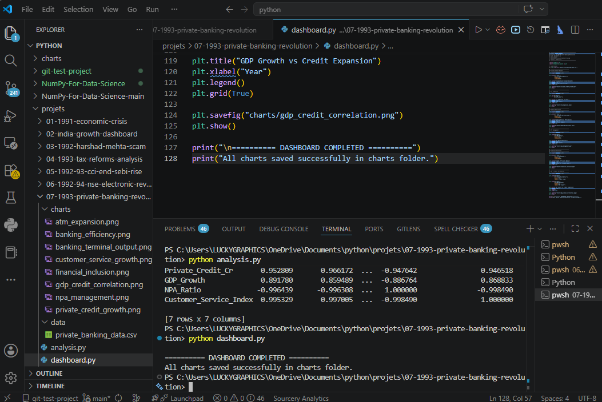
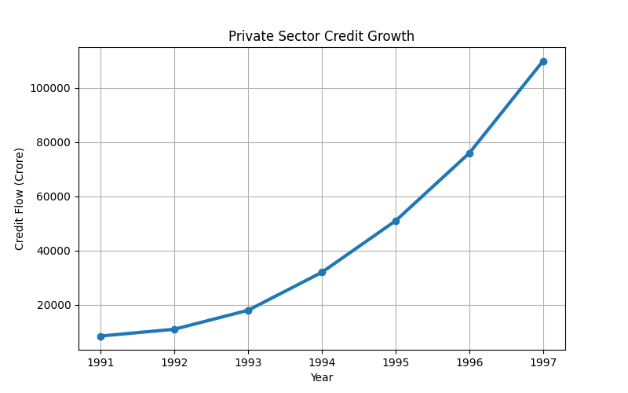
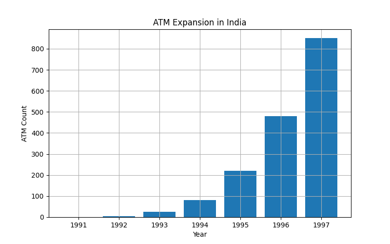
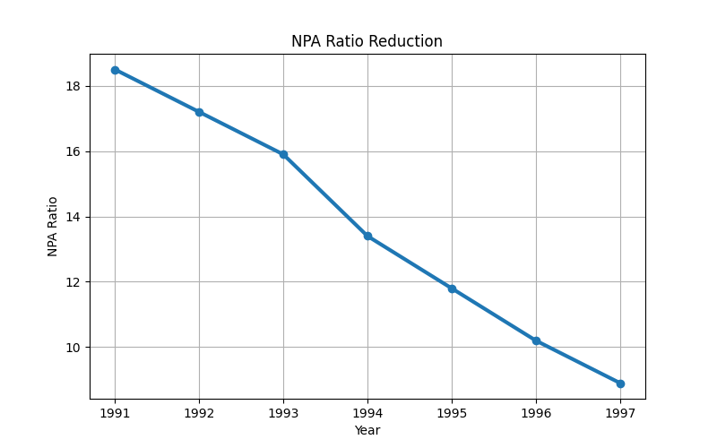
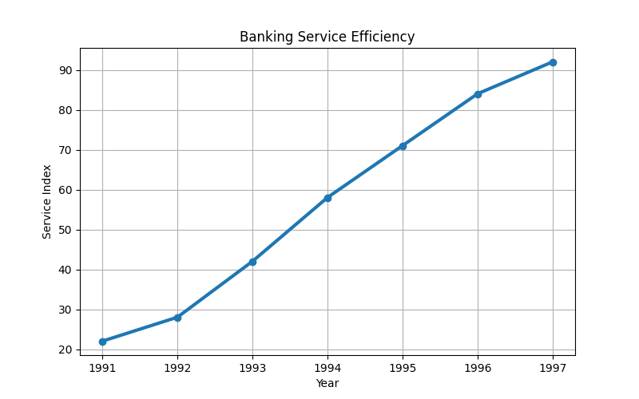
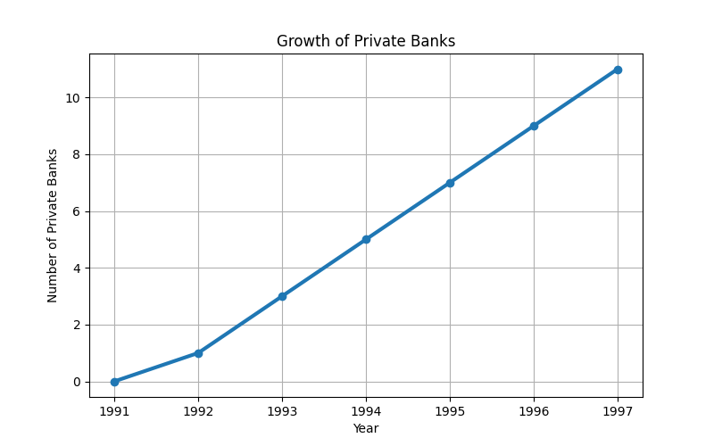
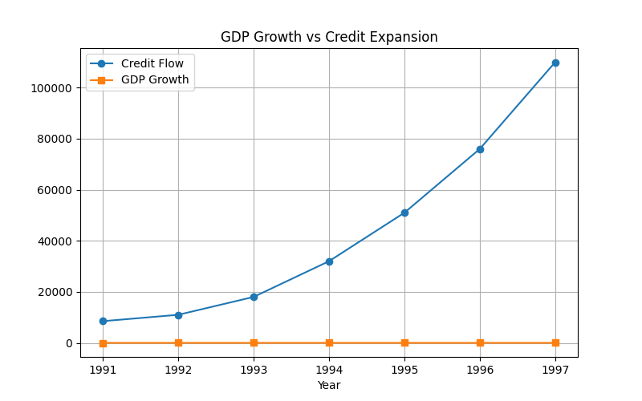

# 🇮🇳 INDIA ECONOMIC REFORMS SERIES
# 07-1993-Private-Banking-Revolution

# Indian Banking Modernization
## Rise of Private Sector Banks in India

---


---

# Project Overview

This project analyzes one of the biggest transformations in Indian financial history:
the rise of **Private Sector Banks** after the 1993 banking reforms.

The project studies how India moved from:
- slow paper-based banking,
- government banking monopoly,
- delayed loan approvals,
- weak customer service,

to:
- modern private banking,
- ATM networks,
- computerized banking,
- fast credit systems,
- and technology-driven financial services.

Using:

- Python
- Pandas
- Matplotlib

this project analyzes:
- private sector credit growth,
- ATM expansion,
- banking efficiency,
- customer service modernization,
- NPA management,
- and GDP-credit correlation.

---

# Historical Background

After the nationalization of banks in:
- 1969
- 1980

India's banking system became dominated by government banks.

The system suffered from:
- low efficiency,
- excessive paperwork,
- slow loan processing,
- weak technology,
- and poor customer service.

To modernize the financial system, the Government of India created the:
# Narasimham Committee (1991-92)

The committee recommended:
- competition in banking,
- private sector participation,
- prudential norms,
- global banking standards,
- and financial modernization.

In January 1993, RBI officially allowed the creation of new private sector banks.

This led to the rise of:
- HDFC Bank
- ICICI Bank
- UTI Bank (Axis Bank)

which transformed India's banking ecosystem forever.

---

# Main Objectives

- Analyze the rise of private sector banks
- Study banking modernization
- Understand ATM expansion
- Analyze banking efficiency
- Study customer service transformation
- Visualize credit growth
- Connect statistics and economics using banking data

---

# Dataset Features

| Column | Description |
|---|---|
| Year | Timeline |
| Private_Banks | Number of private banks |
| ATM_Count | ATM expansion |
| Private_Credit_Cr | Private sector credit flow |
| GDP_Growth | National GDP growth |
| NPA_Ratio | Non-performing asset ratio |
| Customer_Service_Index | Banking service quality |

---

# Dataset Used

```csv
Year,Private_Banks,ATM_Count,Private_Credit_Cr,GDP_Growth,NPA_Ratio,Customer_Service_Index
1991,0,0,8500,1.1,18.5,22
1992,1,5,11000,5.5,17.2,28
1993,3,25,18000,4.8,15.9,42
1994,5,80,32000,6.7,13.4,58
1995,7,220,51000,7.3,11.8,71
1996,9,480,76000,7.8,10.2,84
1997,11,850,110000,8.1,8.9,92
```

---

# 15 Master Key Reform Points

---

# 1️⃣ Government Banking Monopoly

After bank nationalization, public sector banks dominated the entire banking system.

## Problems
- Slow operations
- Heavy paperwork
- Weak efficiency
- Poor customer experience

---

# 2️⃣ Narasimham Committee (1991-92)

The Government formed the Narasimham Committee to modernize Indian banking.

## Objectives
- Global banking standards
- Competition in banking
- Better regulation
- Financial efficiency

---

# 3️⃣ RBI Guidelines for Private Banks (1993)

RBI officially allowed new private sector banks.

## Key Reform
Minimum entry capital requirement:
```text
₹100 Crore
```

---

# 4️⃣ Rise of Financial Giants

This reform led to the creation of:
- HDFC Bank
- ICICI Bank
- UTI Bank (Axis Bank)

These banks modernized Indian banking permanently.

---

# 5️⃣ ATM Revolution & Computerization

Private banks introduced:
- ATM machines
- Core banking systems
- Computerized banking

## Impact
- 24×7 banking access
- Faster transactions
- Reduced manual work

---

# 6️⃣ Faster Credit Availability

Private banks accelerated:
- home loans
- car loans
- retail credit
- corporate lending

## Impact
- Faster loan approvals
- Increased economic activity

---

# 7️⃣ Customer-Centric Banking

Private banks introduced:
- token systems
- clean service centers
- fast customer support
- modern banking standards

## Impact
- Better customer experience
- Competitive banking culture

---

# 8️⃣ Prudential Norms & NPA Management

The reforms introduced:
- NPA classification rules
- Capital Adequacy Ratio (CAR)
- Risk management systems

## Impact
- Financial stability improved
- Banking risk reduced

---

# 9️⃣ Integration with Financial Markets

Private banks connected:
- demat accounts
- online payments
- mutual funds
- capital markets

## Impact
- Integrated financial ecosystem
- Easier investing

---

# 🔟 Foreign Investment in Banking

Private banks were allowed to attract:
- FDI
- Foreign Institutional Investors

## Impact
- Global banking practices entered India
- Better financial technology

---

# 1️⃣1️⃣ Interest Rate Deregulation

Banks gradually received freedom to determine:
- loan interest rates
- deposit rates

based on:
- market demand,
- liquidity,
- and competition.

---

# 1️⃣2️⃣ Rural & Semi-Urban Expansion

RBI required private banks to expand beyond major cities.

## Impact
- Rural banking access improved
- Financial inclusion increased

---

# 1️⃣3️⃣ Priority Sector Lending (PSL)

Private banks were required to lend:
- 40% of total loans
to:
- agriculture,
- MSMEs,
- weaker sections.

## Impact
- Rural liquidity increased
- Economic participation expanded

---

# 1️⃣4️⃣ Modern Treasury & Forex Operations

Private banks introduced:
- forex trading systems
- treasury management
- hedging systems

## Impact
- Better international trade support
- Advanced financial operations

---

# 1️⃣5️⃣ Banking Efficiency vs GDP Growth
## (Mathematics + Statistics Connection)

This is the most unique analytical section of the project.

After private banking reforms:
- private sector credit growth increased
- GDP growth accelerated
- banking productivity improved

A strong positive correlation emerged between:
- credit flow,
- and GDP growth.

## Correlation Formula

:contentReference[oaicite:0]{index=0}

## Statistical Interpretation

- Higher credit flow → higher GDP growth
- Better banking efficiency → higher economic productivity
- Lower NPAs → stronger financial stability

This creates a direct connection between:
- Banking
- Statistics
- Economics
- Financial Efficiency

---

# 📊 Data Visualizations

## Terminal Output



---

## Private Credit Growth



---

## ATM Expansion



---

## NPA Management



---

## Banking Efficiency



---

## Financial Inclusion



---

## GDP & Credit Correlation



---

# Why This Project Is Powerful

This project connects:

Economics  
+ Banking  
+ Finance  
+ Statistics  
+ Mathematics  
+ Technology  
+ Financial Inclusion  
+ Economic Growth

This creates a highly advanced financial analytics project.

---

# Technologies Used

- Python
- Pandas
- Matplotlib

---

# Project Structure

```bash
07-1993-private-banking-revolution/
│
├── charts/
│   ├── private_credit_growth.png
│   ├── atm_expansion.png
│   ├── banking_efficiency.png
│   ├── npa_management.png
│   ├── customer_service_growth.png
│   ├── financial_inclusion.png
│   ├── gdp_credit_correlation.png
│   └── banking_terminal_output.png
│
├── data/
│   └── private_banking_data.csv
│
├── analysis.py
├── dashboard.py
├── requirements.txt
└── README.md
```

---

# Data Source

The dataset used in this project is educational and research-oriented, created using historical banking modernization trends from:

- RBI Banking Reform Reports
- Narasimham Committee Recommendations
- Economic Survey of India
- Indian Banking Sector Studies
- Financial Market Research Reports
- Public Banking Statistics

The dataset was structured for:
- educational analysis,
- financial learning,
- statistics practice,
- and visualization purposes.

---

# Source References

## Reserve Bank of India (RBI)
https://www.rbi.org.in/

## Ministry of Finance
https://www.finmin.nic.in/

## Economic Survey of India
https://www.indiabudget.gov.in/economicsurvey/

## SEBI
https://www.sebi.gov.in/

## National Stock Exchange (NSE)
https://www.nseindia.com/

---

# How to Run

## Step 1 — Install Libraries

```bash
pip install pandas matplotlib
```

---

## Step 2 — Run Analysis

```bash
python analysis.py
```

---

## Step 3 — Run Dashboard

```bash
python dashboard.py
```

---

# Output

The project automatically generates:

- Statistical analysis
- Banking insights
- Financial visualizations
- PNG chart files

All charts are automatically saved inside the `charts/` folder.

---

# Key Learning Outcomes

This project demonstrates:

- Banking modernization
- Financial statistics
- Credit-growth relationships
- ATM & digital banking expansion
- Financial inclusion analysis
- Banking risk management
- Data analysis using Python
- Visualization using Matplotlib

---

# Conclusion

The 1993 private banking reforms transformed India's banking ecosystem.

The shift from:
- slow government banking,
- manual operations,
- and paper-based systems

to:
- technology-driven private banking,
- ATM networks,
- modern customer service,
- and efficient credit systems

created the foundation of modern Indian banking.

These reforms permanently changed:
- banking efficiency,
- financial accessibility,
- credit expansion,
- and economic growth in India.

---

# Educational Disclaimer

This project is created for:

- educational purposes
- historical analysis
- banking research
- statistics practice
- Python visualization

The dataset represents modeled historical banking reform trends for educational and analytical purposes.

---

# Thank You

Made with Python, Statistics, Banking Analytics, and Financial Research.

# Author
## Saloni Tiwari
🎓 IIT Madras BS Degree in Data Science

🎓 B.Sc Mathematics


Python • Data Analytics • Statistics • Economic Visualization • Historical Economic Research

---

# ⭐ GitHub Repository

If you found this repository useful, consider giving it a ⭐ on GitHub.

---

# 📄 Repository Draft Reference

Based on repository draft structure and uploaded project documentation. :contentReference[oaicite:0]{index=0}
