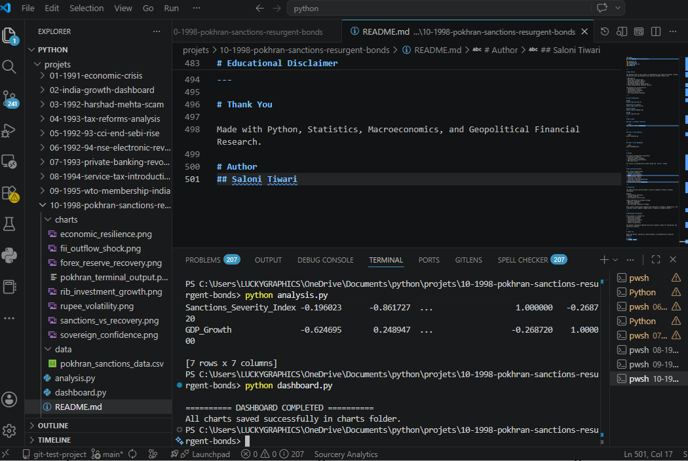
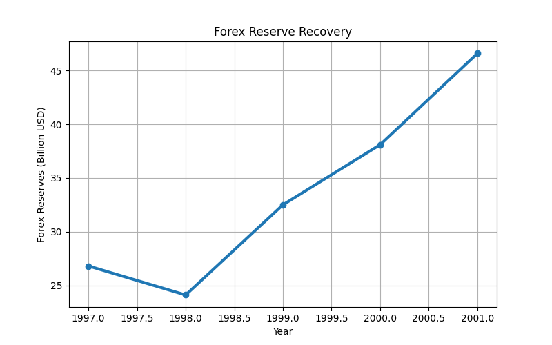
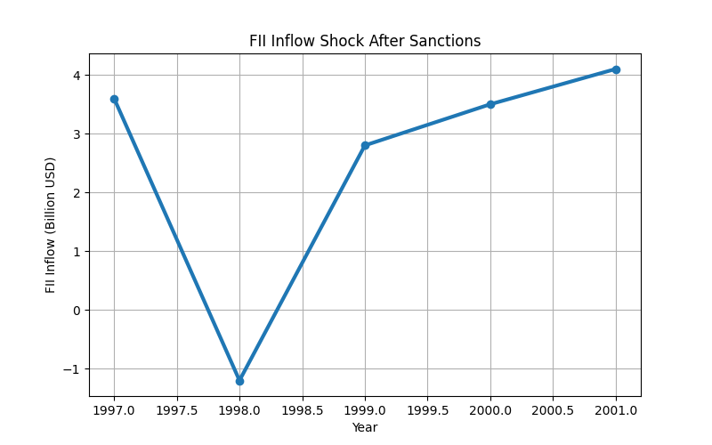
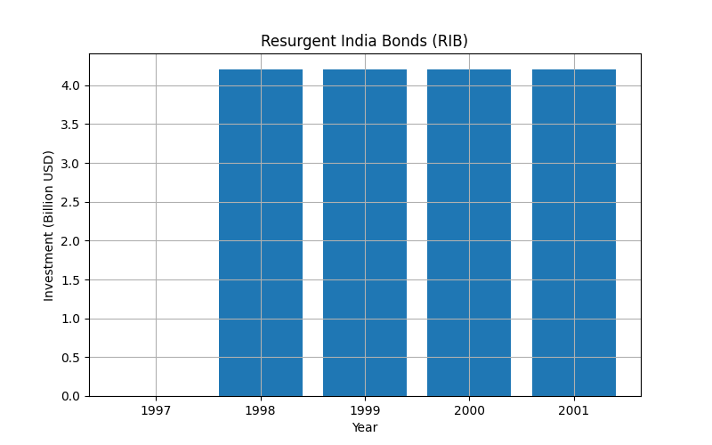
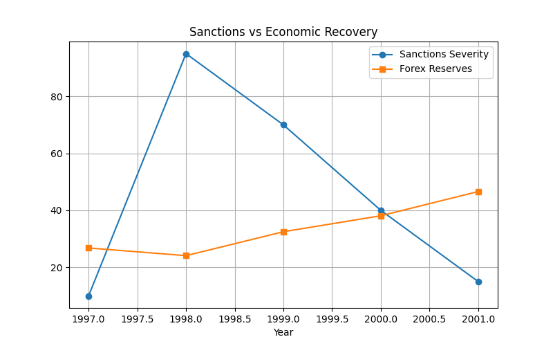
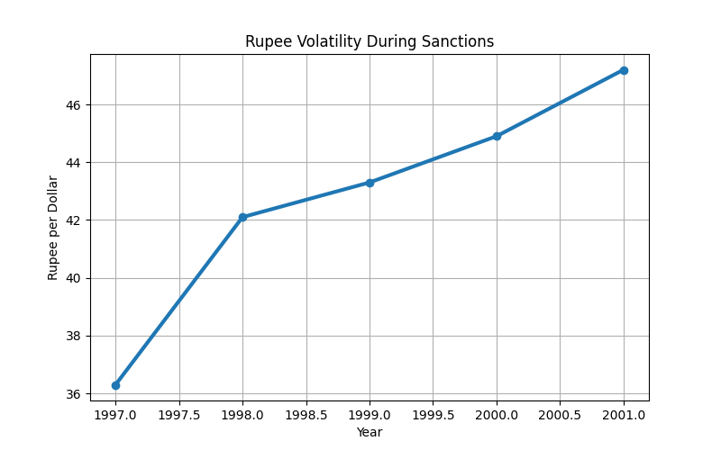
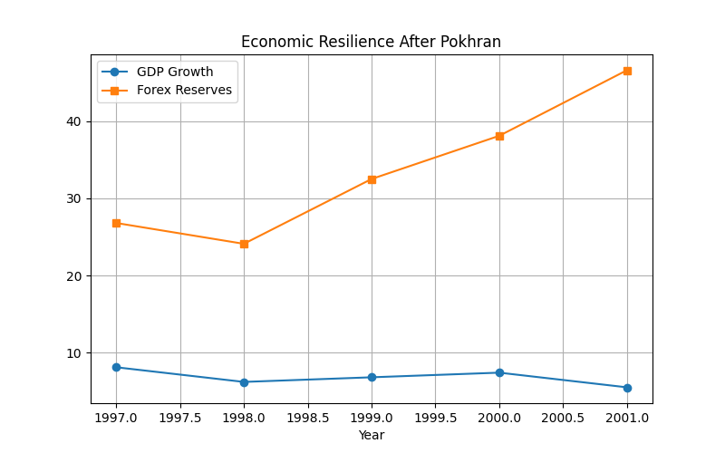
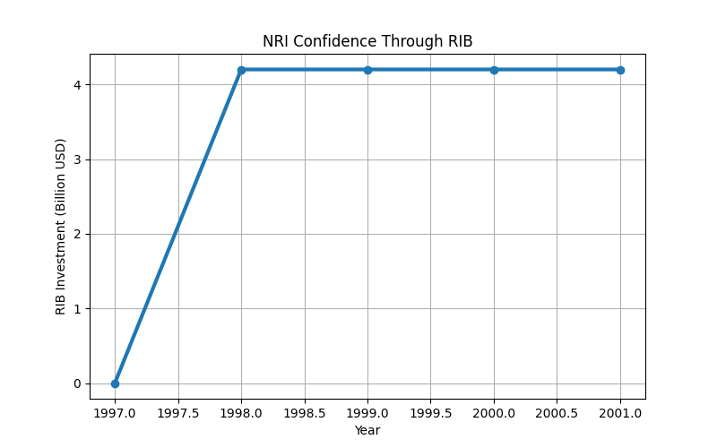

# 🇮🇳 INDIA ECONOMIC REFORMS SERIES
# 10-1998-Pokhran-Sanctions-Resurgent-Bonds

# Economic Sovereignty Under Global Sanctions
## Pokhran-II, Economic Pressure & India's Financial Response

---


---

# Project Overview

This project analyzes one of the most important moments in India's modern economic and geopolitical history:
the 1998 Pokhran-II nuclear tests, the international sanctions imposed on India, and the country's successful financial recovery through:
# Resurgent India Bonds (RIB)

The project studies:
- sanctions impact,
- FII outflows,
- forex reserve pressure,
- rupee volatility,
- sovereign financial response,
- and India's economic resilience.

Using:
- Python
- Pandas
- Matplotlib

this project analyzes:
- forex reserve recovery,
- sanctions severity,
- foreign investment shocks,
- RIB inflows,
- and post-sanction economic stabilization.

---

# Historical Background

On:
# 11 May and 13 May 1998

India successfully conducted:
# Pokhran-II Nuclear Tests

under Prime Minister:
# Atal Bihari Vajpayee

After the tests:
- the United States,
- Japan,
- and several Western nations

imposed economic sanctions on India.

The sanctions targeted:
- foreign aid,
- multilateral loans,
- high technology exports,
- and financial cooperation.

However, India responded through:
- domestic resilience,
- strategic financial planning,
- and the launch of Resurgent India Bonds (RIB).

This became a historic example of economic sovereignty under external pressure.

---

# Main Objectives

- Analyze economic sanctions impact
- Study FII outflow shocks
- Visualize forex reserve recovery
- Analyze rupee volatility
- Understand the role of Resurgent India Bonds
- Study India's economic resilience
- Connect statistics with macroeconomic shocks

---

# Dataset Features

| Column | Description |
|---|---|
| Year | Timeline |
| FII_Inflow_Bn | Foreign institutional investment |
| Forex_Reserves_Bn | Foreign exchange reserves |
| Rupee_Per_Dollar | Exchange rate |
| RIB_Investment_Bn | Resurgent India Bonds inflow |
| Sanctions_Severity_Index | Sanctions pressure indicator |
| GDP_Growth | GDP growth rate |

---

# Dataset Used

```csv
Year,FII_Inflow_Bn,Forex_Reserves_Bn,Rupee_Per_Dollar,RIB_Investment_Bn,Sanctions_Severity_Index,GDP_Growth
1997,3.6,26.8,36.3,0,10,8.1
1998,-1.2,24.1,42.1,4.2,95,6.2
1999,2.8,32.5,43.3,4.2,70,6.8
2000,3.5,38.1,44.9,4.2,40,7.4
2001,4.1,46.6,47.2,4.2,15,5.5
```

---

# 15 Master Key Points

---

# 1️⃣ Pokhran-II Nuclear Tests

India conducted 5 successful nuclear tests in May 1998.

## Global Reaction
- International criticism
- Economic sanctions
- Technology restrictions

---

# 2️⃣ Glenn Amendment Activation

The United States activated:
# Glenn Amendment

which legally required sanctions against non-nuclear states conducting nuclear tests.

---

# 3️⃣ Foreign Aid Blockade

Several countries froze:
- aid programs,
- infrastructure support,
- development assistance.

---

# 4️⃣ World Bank & IMF Pressure

International pressure delayed:
- development loans,
- infrastructure financing,
- and multilateral assistance.

---

# 5️⃣ High-Technology Restrictions

The sanctions blocked exports of:
- advanced computers,
- aerospace components,
- dual-use technologies.

Organizations like:
- ISRO
- DRDO

faced restrictions and blacklisting.

---

# 6️⃣ Forex & Rupee Pressure

Foreign investors withdrew capital from Indian markets.

## Impact
- Rupee depreciation
- Forex reserve pressure
- Financial uncertainty

---

# 7️⃣ India's Counter-Strategy

India adopted a self-reliant financial response strategy.

Instead of external dependence, India mobilized:
# NRI Capital Support

---

# 8️⃣ Resurgent India Bonds (RIB)

In August 1998:
# State Bank of India (SBI)

launched:
# Resurgent India Bonds

for Non-Resident Indians (NRIs).

---

# 9️⃣ Historic NRI Response

NRIs invested:
# $4.2 Billion

within weeks.

## Impact
- Forex reserves stabilized
- Investor confidence improved
- External pressure reduced

---

# 🔟 Failure of Economic Sanctions

The sanctions failed to destabilize India economically.

India raised more capital through RIBs than expected from international loans.

---

# 1️⃣1️⃣ Pressure from American Corporations

US corporations like:
- Boeing
- General Electric (GE)

faced business losses due to sanctions.

This created pressure inside the United States to normalize relations.

---

# 1️⃣2️⃣ Gradual Removal of Sanctions

Between:
# 1999–2001

most sanctions were gradually removed.

---

# 1️⃣3️⃣ Rise of Indigenous Technology

The restrictions encouraged India to build:
- indigenous aerospace systems,
- supercomputers,
- cryogenic engines,
- and domestic defense technologies.

---

# 1️⃣4️⃣ Rise of India's Economic Sovereignty

The successful recovery improved:
- global confidence,
- sovereign credibility,
- and India's economic reputation.

---

# 1️⃣5️⃣ Capital Flow vs External Shock
## (Mathematics + Statistics Connection)

This is the most unique analytical section of the project.

During sanctions:
- FII inflows showed sudden variance shifts,
- forex reserves faced pressure,
- rupee volatility increased.

After RIB introduction:
- forex reserves rapidly recovered,
- economic stability improved.

## Standard Deviation Concept


::contentReference[oaicite:0]{index=0}


## Variance Formula

:contentReference[oaicite:1]{index=1}

## Statistical Interpretation

- High variance → external shock instability
- RIB inflow → stabilization effect
- Forex reserves moved above +2 standard deviation recovery trend

This creates a direct connection between:
- Statistics
- Macroeconomics
- Geopolitics
- Financial Sovereignty

---

# 📊 Data Visualizations

## Terminal Output



---

## Forex Reserve Recovery



---

## FII Outflow Shock



---

## RIB Investment Growth



---

## Sanctions vs Recovery



---

## Rupee Volatility



---

## Economic Resilience



---

## Sovereign Confidence


---

# Why This Project Is Powerful

This project connects:

Economics  
+ Geopolitics  
+ Statistics  
+ Mathematics  
+ Foreign Investment  
+ Financial Sovereignty  
+ Macroeconomics  
+ National Resilience

This creates a highly advanced geopolitical-economic analytics project.

---

# Technologies Used

- Python
- Pandas
- Matplotlib

---

# Project Structure

```bash
10-1998-pokhran-sanctions-resurgent-bonds/
│
├── charts/
│   ├── forex_reserve_recovery.png
│   ├── fii_outflow_shock.png
│   ├── rib_investment_growth.png
│   ├── sanctions_vs_recovery.png
│   ├── rupee_volatility.png
│   ├── economic_resilience.png
│   ├── sovereign_confidence.png
│   └── pokhran_terminal_output.png
│
├── data/
│   └── pokhran_sanctions_data.csv
│
├── analysis.py
├── dashboard.py
├── requirements.txt
└── README.md
```

---

# Data Source

The dataset used in this project is educational and research-oriented, created using historical macroeconomic and sanctions-related trends from:

- RBI Reports
- Ministry of Finance Data
- World Bank Economic Reports
- IMF Macroeconomic Studies
- Government Economic Publications
- Public Geopolitical Research Sources

The dataset was structured for:
- educational analysis,
- macroeconomic learning,
- statistics practice,
- and visualization purposes.

---

# Source References

## RBI
https://www.rbi.org.in/

## Ministry of Finance
https://www.finmin.nic.in/

## World Bank
https://www.worldbank.org/

## IMF
https://www.imf.org/

---

# How to Run

## Step 1 — Install Libraries

```bash
pip install pandas matplotlib
```

---

## Step 2 — Run Analysis

```bash
python analysis.py
```

---

## Step 3 — Run Dashboard

```bash
python dashboard.py
```

---

# Output

The project automatically generates:
- statistical analysis,
- sanctions impact insights,
- macroeconomic visualizations,
- PNG chart files.

All charts are automatically saved inside the `charts/` folder.

---

# Key Learning Outcomes

This project demonstrates:
- sanctions economics,
- capital flow analysis,
- forex reserve dynamics,
- macroeconomic shocks,
- financial resilience,
- sovereign financing mechanisms,
- Python data analysis,
- visualization using Matplotlib.

---

# Conclusion

The 1998 sanctions period became a historic example of India's economic resilience.

Despite:
- international sanctions,
- foreign pressure,
- and financial restrictions,

India stabilized its economy through:
- domestic confidence,
- NRI participation,
- and sovereign financial strategy.

This project analytically explains how statistics, economics, geopolitics, and financial policy together shaped India's response to global pressure.

---

# Educational Disclaimer

This project is created for:
- educational purposes
- historical analysis
- macroeconomic research
- statistics practice
- Python visualization

The dataset represents modeled historical economic trends for educational and analytical purposes.

---

# Thank You

Made with Python, Statistics, Macroeconomics, and Geopolitical Financial Research.

# Author
## Saloni Tiwari
🎓 IIT Madras BS Degree in Data Science

🎓 B.Sc Mathematics


Python • Data Analytics • Statistics • Economic Visualization • Historical Economic Research

---

# ⭐ GitHub Repository

If you found this repository useful, consider giving it a ⭐ on GitHub.

---

# 📄 Repository Draft Reference

Based on repository draft structure and uploaded project documentation.
