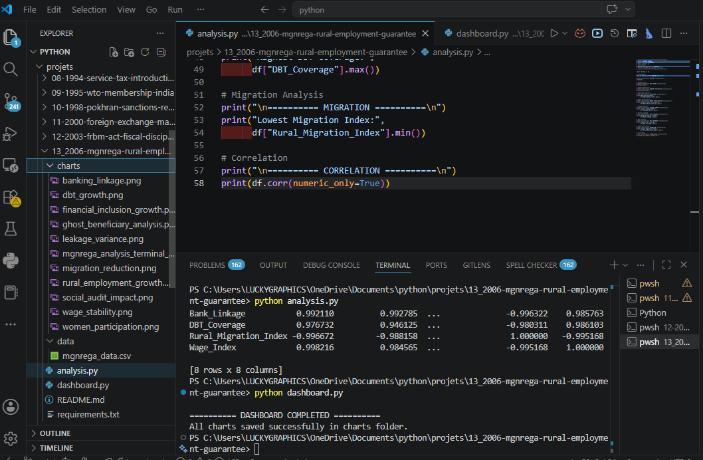
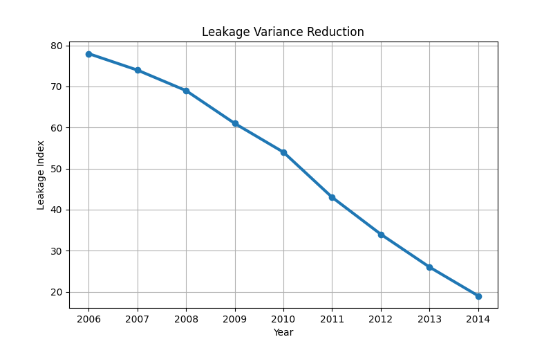
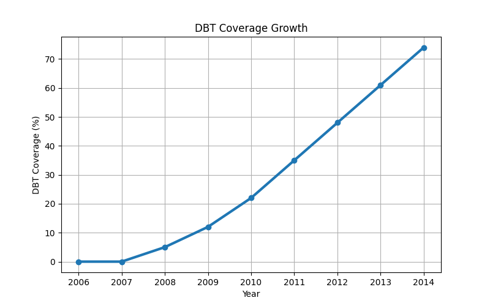
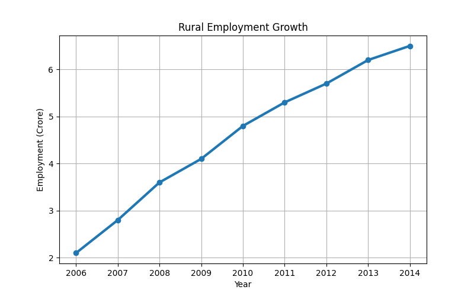
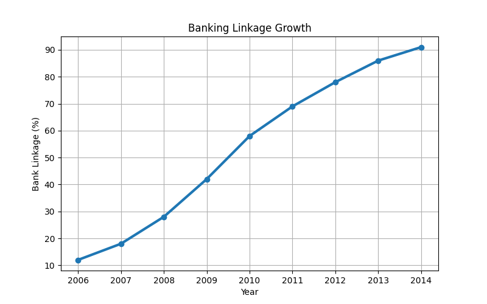
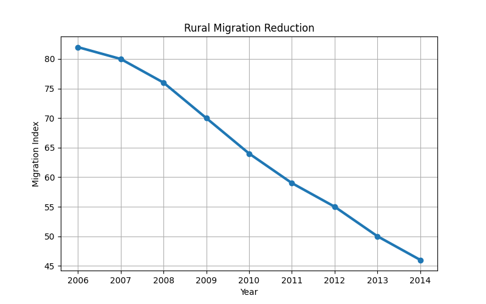
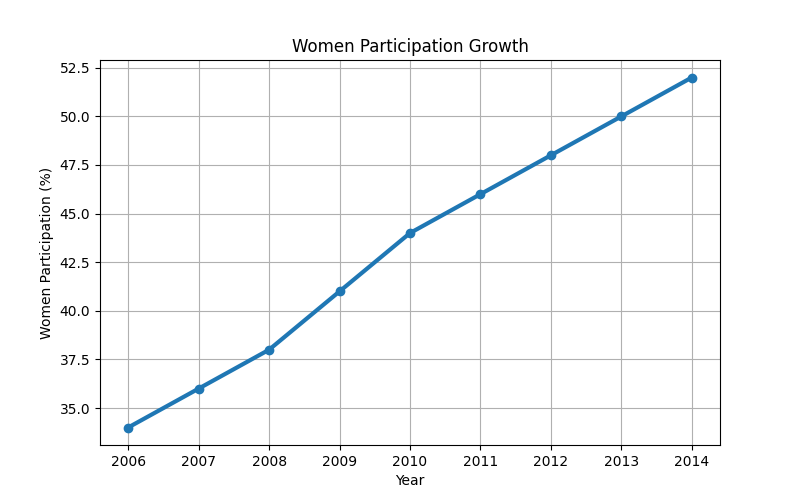

# 🇮🇳 INDIA ECONOMIC REFORMS SERIES
# 🇮🇳 13_2006-MGNREGA-Rural-Employment-Guarantee

# Mahatma Gandhi National Rural Employment Guarantee Act (MGNREGA)
## Rural Employment • Welfare Governance • Financial Inclusion • Statistical Analytics

---


---

# 📌 Project Overview

This project analyzes one of the most revolutionary rural welfare reforms in Indian history:

# MGNREGA (Mahatma Gandhi National Rural Employment Guarantee Act), 2006

This project deeply studies:

- Rural employment guarantees
- Welfare state economics
- Corruption loopholes
- Ghost beneficiary fraud
- Financial inclusion
- Banking linkage reforms
- DBT transformation
- Aadhaar-linked governance
- Rural migration reduction
- Statistical leakage analysis

using:

- Python
- Pandas
- NumPy
- Matplotlib
- Statistics
- Economic Visualization

---

# 🎯 Main Objectives

- Analyze India's rural employment revolution
- Study welfare leakages and corruption patterns
- Understand DBT transformation
- Analyze financial inclusion growth
- Visualize rural migration reduction
- Study women workforce participation
- Connect governance with mathematics & statistics
- Build advanced welfare analytics dashboards

---

# 🏛 Historical Background

MGNREGA officially launched on:

# 2 February 2006

Initially implemented across:

- 200 backward districts of India

This law became the first major welfare legislation in Indian history that legally guaranteed:

# Right To Work

to rural households.

Every eligible rural family received:

- 100 days guaranteed employment
- Wage protection
- Rural livelihood security
- Crisis-time support
- Village infrastructure development

This transformed India's rural welfare architecture forever.

---

# 🔥 15 Core Key Points

---

# 1️⃣ Right To Work Revolution

MGNREGA introduced a historic legal concept:

# "Right To Work"

For the first time in independent India:

- employment became a legal guarantee,
- not merely a government scheme.

This was one of the largest welfare transformations in Indian history.

---

# 2️⃣ 100 Days Employment Guarantee

The Act guaranteed:

- 100 days of employment
- Unskilled manual work
- Rural income protection
- Economic security during crises

This acted as a rural safety net during:

- droughts,
- agricultural collapse,
- and seasonal unemployment.

---

# 3️⃣ Women Empowerment & Equal Wages

The law mandated:

- Minimum 33% women participation
- Equal wages for men and women

This reduced:

- rural gender wage gaps,
- financial dependency,
- and labor inequality.

MGNREGA became one of India's largest women workforce participation programs.

---

# 4️⃣ Rural Asset Creation

The scheme focused on:

- Pond construction
- Water conservation
- Canal systems
- Rural roads
- Soil protection
- Environmental sustainability

These assets improved:

- groundwater levels,
- agricultural productivity,
- village infrastructure,
- and drought resilience.

---

# 5️⃣ Cash-Based Corruption Crisis

During 2006–2010:

Most payments were made through:

- cash distribution,
- local intermediaries,
- village-level officials.

This created massive corruption loopholes.

The cash-based payment structure became the root cause of:

- wage theft,
- fake payments,
- and welfare leakages.

---

# 6️⃣ Ghost Beneficiary Fraud

Fake workers were illegally inserted into:

- muster rolls,
- attendance records,
- wage systems.

These included:

- dead individuals,
- non-existent villagers,
- fake labor entries.

Corrupt intermediaries withdrew wages using fake identities.

---

# 7️⃣ Job Card Seizure

Local middlemen often:

- captured workers' job cards,
- controlled attendance systems,
- diverted wage payments.

Poor laborers frequently remained unaware that wages were being withdrawn in their names.

---

# 8️⃣ Illegal Machine Usage

MGNREGA legally allowed:

# Human labor only

However, many contractors illegally used:

- JCB machines,
- excavation equipment,
- heavy machinery,

while fake attendance records continued on paper.

This destroyed employment generation objectives.

---

# 9️⃣ Decentralized Corruption Nexus

Weak monitoring systems created local corruption networks involving:

- village heads,
- contractors,
- junior engineers,
- local officials,
- middlemen.

This became a classic example of:

# Decentralized Governance Failure

in the absence of transparency systems.

---

# 🔟 Social Audit Failure

Although the law mandated:

# Social Audits

initial implementation remained weak because of:

- low awareness,
- fear of local elites,
- weak transparency culture,
- lack of digital monitoring.

Social audits initially remained limited to paperwork.

---

# 1️⃣1️⃣ Banking Linkage Reforms

After 2008–09:

Government introduced:

- bank account payments,
- post office linkage,
- reduced cash handling systems.

This became the first major step toward:

# Financial Inclusion

Leakages began declining significantly after banking integration.

---

# 1️⃣2️⃣ Rural Wage Stabilization

MGNREGA created a:

# Rural Wage Floor Effect

This forced local landlords and contractors to:

- offer fairer wages,
- reduce labor exploitation,
- improve rural wage standards.

This improved:

- bargaining power,
- living standards,
- and rural purchasing capacity.

---

# 1️⃣3️⃣ Rural Migration Reduction

Before MGNREGA:

millions of workers migrated seasonally to cities because of lack of rural employment.

MGNREGA reduced:

- distress migration,
- seasonal migration,
- urban labor pressure.

Local employment created rural economic stability.

---

# 1️⃣4️⃣ DBT & Aadhaar Revolution

The failures of cash systems taught policymakers that:

# corruption cannot be reduced without financial technology.

This directly inspired:

- DBT (Direct Benefit Transfer)
- Aadhaar Seeding
- Digital Governance
- Financial Inclusion Infrastructure

This eventually removed:

- middlemen,
- fake beneficiaries,
- and payment leakages.

---

# 1️⃣5️⃣ Statistics & Variance Connection
## (Most Important Analytical Section)

This project strongly connects:

- Statistics
- Governance
- Economics
- Welfare Systems
- FinTech

The project studies:

- Leakage Variance
- Banking Penetration Correlation
- DBT Stabilization
- Welfare Efficiency
- Migration Reduction Trends

---

# 📊 Variance Formula

:contentReference[oaicite:0]{index=0}

---

# 📈 Statistical Interpretation

Between:

# 2006 → 2009

Government allocations increased significantly.

However:

# Leakage Index remained extremely high

because payments were cash-based.

After:

- banking linkage,
- DBT systems,
- Aadhaar integration,

the variance in leakage sharply declined.

This mathematically proves:

# Welfare systems become efficient only when combined with Financial Technology (FinTech)

---

# 📂 Project Structure

```text
13_2006-mgnrega-rural-employment-guarantee/

│
├── data/
│   └── mgnrega_data.csv
│
├── charts/
│   ├── leakage_variance.png
│   ├── dbt_growth.png
│   ├── rural_employment_growth.png
│   ├── migration_reduction.png
│   ├── banking_linkage.png
│   ├── women_participation.png
│   ├── wage_stability.png
│   ├── ghost_beneficiary_analysis.png
│   ├── social_audit_impact.png
│   └── financial_inclusion_growth.png
│
├── analysis.py
├── dashboard.py
├── requirements.txt
└── README.md
```

---

# 📄 Dataset Features

| Column | Description |
|---|---|
| Year | Timeline |
| Employment_Crore | Rural employment generation |
| Women_Participation | Female participation rate |
| Leakage_Index | Corruption leakage level |
| Bank_Linkage | Financial inclusion growth |
| DBT_Coverage | Direct Benefit Transfer penetration |
| Rural_Migration_Index | Migration pressure indicator |
| Wage_Index | Rural wage growth |

---
# 📊 Data Visualizations

## Terminal Output



---

## Leakage Variance Reduction



---

## DBT Coverage Growth



---

## Rural Employment Growth



---

## Banking Linkage Growth



---

## Migration Reduction



---

## Women Participation



---

# 🛠 Technologies Used

- Python
- Pandas
- NumPy
- Matplotlib
- Statistics
- CSV Data Handling
- Economic Visualization

---

# 📚 Data Sources & References

This project uses educational and research-oriented datasets inspired from:

- Ministry of Rural Development
- Government of India
- RBI Reports
- Economic Survey of India
- NITI Aayog Publications
- MGNREGA Official Reports
- NSSO Rural Employment Data
- Financial Inclusion Reports

---

# 📦 Installation

## Clone Repository

```bash
git clone https://github.com/25f2005869-glitch/india-growth-dashboard.git
```

---

## Go To Project Folder

```bash
cd 13_2006-mgnrega-rural-employment-guarantee
```

---

## Install Dependencies

```bash
pip install -r requirements.txt
```

---

## Run Analysis

```bash
python analysis.py
```

---

## Run Dashboard

```bash
python dashboard.py
```

---

# 🚀 Future Improvements

Planned upgrades:

- Streamlit Dashboard
- Interactive Rural Maps
- Welfare Fraud Prediction Models
- Machine Learning Analytics
- Aadhaar Linkage Analytics
- DBT Efficiency Forecasting
- Time-Series Analysis
- Rural Development Prediction Systems

---

# 🎯 Learning Outcomes

This project helps in understanding:

- Welfare Economics
- Governance Analytics
- Financial Inclusion
- Rural Development Systems
- DBT Infrastructure
- Public Policy Analytics
- Statistics in Governance
- Data Visualization
- Economic Modeling

---

# 🔥 Why This Project Is Powerful

This project uniquely combines:

Economics  
+ Governance  
+ Welfare Systems  
+ Statistics  
+ Mathematics  
+ FinTech  
+ Rural Development  
+ Public Policy Analytics

This creates a highly advanced analytical governance project.

---

# 👩‍💻 Author

## Saloni Tiwari

Python • Statistics • Economic Analytics • Governance Research • Rural Development Analytics

---

# ⭐ Repository Vision

Part of the long-term:

# 🇮🇳 INDIA ECONOMIC REFORMS SERIES

A research-oriented repository connecting:

- Indian Economic History
- Governance Reforms
- Welfare Systems
- Financial Inclusion
- Statistics
- Mathematics
- Data Science
- Economic Analytics
