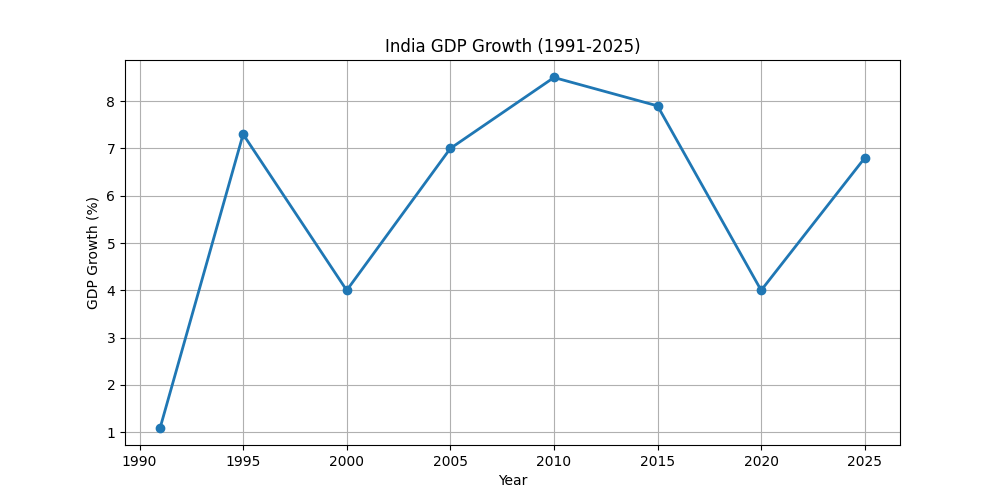
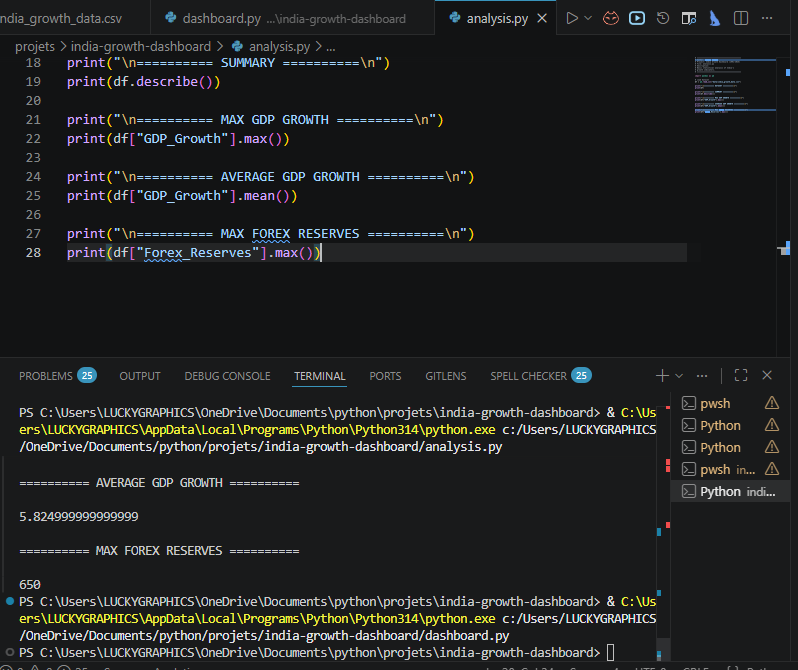

# 🇮🇳 India Growth & Development Dashboard (1991–2025)

An economic data analytics project built using **Python, Pandas, Matplotlib, NumPy, and Statistics** to analyze India's growth journey from 1991 to 2025.

---

# 📌 Project Overview

This project focuses on analyzing and visualizing:

- 📈 GDP Growth Trends
- 💰 Forex Reserve Growth
- 📊 Economic Data Visualization
- 📉 Statistical Analysis

The project demonstrates practical usage of:

- Data Analysis
- CSV Handling
- Visualization
- Python Programming
- Statistics

---

# 🛠 Technologies Used

- Python
- Pandas
- Matplotlib
- NumPy
- CSV Data Handling

---

# 📂 Project Structure

india-growth-dashboard/

├── analysis.py

├── dashboard.py

├── india_growth_data.csv

├── gdp_growth.png

├── forex_reserves.png

├── analysis_terminal_output.png

└── README.md

---

# 📊 Features

✅ GDP Growth Analysis  
✅ Forex Reserve Analysis  
✅ Statistical Insights  
✅ Data Visualization  
✅ CSV File Handling  
✅ Economic Trend Analysis  

---

# 📈 GDP Growth Visualization

---

# 💰 Forex Reserve Visualization

---

# 🖥 Analysis Terminal Output

---

# 📊 Statistical Analysis Included

The project calculates:

- Maximum GDP Growth
- Average GDP Growth
- Maximum Forex Reserves
- Summary Statistics using Pandas

---

# 🚀 Future Improvements

- Streamlit Interactive Dashboard
- Real Government Dataset Integration
- Inflation Analysis
- Population Analysis
- Employment Trends
- AI-Based Prediction Models
- Advanced Visualizations

---

# 🎯 Learning Objectives

This project helped in improving:

- Data Analysis Skills
- Pandas DataFrame Handling
- CSV Operations
- Data Visualization
- Statistical Thinking
- GitHub Project Management

---

# 🇮🇳 Inspiration

India's economic reforms and development journey inspired this project.  
The dashboard aims to represent economic growth through data analytics and visualization.

---

# 👩‍💻 Author

**Saloni Tiwari**

Python | Statistics | Data Analytics

---

# ⭐ GitHub Repository

If you found this project useful, consider giving it a ⭐ on GitHub.

